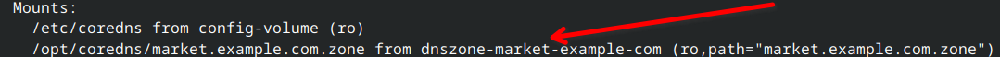
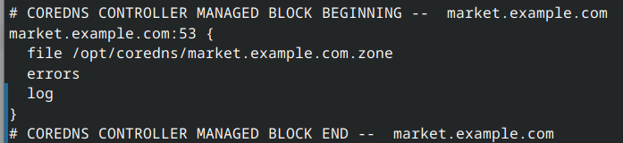

# Manual Testing Guide for CoreDNS Operator

**>IMPORTANT:** Follow this scenario precisely. All steps should function as intended, leading to results that match the provided example. If unexpected behavior occurs, or the outcome deviates from the example, **STOP**.
Troubleshoot the issue using available resources or report it with details.

**NOTE:** This guide shows examples of operator log output. However, the format might vary depending on the log level configuration.

---

## Prerequisites
* k3s version: => v1.29.5+k3s1 or KinD => 0.20.0
* `kube-dns` service is exposed
* `coredns-controller-manager` is running
* It is recommended to switch the current context to the `kube-system`

## Basic Functionality Test

To install demo resources from config/samples use the following command.
```sh
$ kubectl apply -k config/samples/
```

This will install the following components:
* DNSConnector: Integrates with k3s's coredns.
* DNSZone
  * market-example-zone: Normal zone.
  * no-connector-test-zone: Zone to test behavior when the wrong connector is requested.
* DNSRecords
  * A total of 12 records will be deployed for `market.example.com` zone.
  * 1 DNSRecord without a DNSZone.

Run apply and wait for about a minute for reconciliation to complete. Keep an eye on controller logs to ensure they remain error-free.


### DNSConnector Review

1. Describe DNSConnector resource.
   
   ```sh
   $ kubectl get dnsconnectors coredns -o json | jq '{spec: .spec, status: .status}'
   ```
   ```json
   {
     "spec": {
       "corednsCM": {
         "corefileKey": "Corefile",
         "name": "coredns"
       },
       "corednsDeployment": {
         "name": "coredns",
         "type": "Deployment",
         "zonefilesMountDir": "/opt/coredns"
       },
       "corednsZoneEnaledPlugins": [
         "errors",
         "log"
       ],
       "waitForUpdateTimeout": 120
     },
     "status": {
       "conditions": [
         {
           "lastTransitionTime": "2024-06-04T13:01:57Z",
           "message": "CoreDNS Ready",
           "observedGeneration": 1,
           "reason": "Active",
           "status": "True",
           "type": "Ready"
         }
       ],
       "provisionedZones": [
         {
           "domain": "market.example.com",
           "name": "market-example-zone",
           "serialNumber": "0604130139"
         }
       ]
     }
   }
   ```
 
   * The setup should be ready and include `provisionedZones`.
  
2. Inspect coredns deployment
   ```sh
   $ kubectl describe deployments coredns | grep Mount -A4
   ```
   Ensure that it includes `market.example.com` mount.

   

3. DNSConnector will backup the original coredns configMap. Make sure it exists
   ```sh
   $ kubectl describe cm coredns-original-configmap
   ```

4. Inspect the coredns configMap
   ```sh
   $ kubectl describe cm coredns
   ```
   At the end of the file, it must contain the following data.

   

### DNSZone Review
1. Get DNSZone resources.
   ```sh
   $ kubectl get dnszones
   NAME                     DOMAIN NAME          RECORD COUNT   LAST CHANGE            CURRENT SERIAL   STATE
   no-connector-test-zone   test.com.            0              2024-06-04T12:57:41Z   0604125740       Pending
   market-example-zone      market.example.com   12             2024-06-04T12:57:40Z   0604130139       Active
   ```
   * no-connector-test-zone - should be in the `Pending` state 
   * market-example-zone - should be in the `Active` state

2. Compare that the "no-connector-test-zone" has the same serial as the DNSConnector.
   ```sh
   # Get connector status
   $ kubectl get dnsconnector coredns -o jsonpath='{.status.provisionedZones}' | jq .

   # Get dnszone serial
   $ kubectl get dnszone market-example-zone -o jsonpath='{.status.currentZoneSerial}' | jq 
   ```

3. The DNSZone resource produces the zone configMap. If you attempt to delete it, the finalizer should prevent you.
   ```sh
   $ kubectl delete cm coredns-zone-market-example-zone
   ^C
   ```

### Review DNSRecords
1. Get DNSRecord resources.  The "record-no-zone-test" should be in the `Pending` state, while the rest should be `Ready`.
   ```sh
   $ kubectl get dnsrecords
   NAME                              RECORD NAME                RECORD TYPE   RECORD VALUE                                                                    ZONE REFERENCE             LAST CHANGE            STATE
   record-no-zone-test               haproxy.cpe                A             10.149.149.10                                                                   this-zone-does-not-exist   2024-06-04T12:57:40Z   Pending
   dnskey-market-example             @                          DNSKEY        257 3 8 AwEAAaKdjGVkvFjdLv...5A5t5y7yQ8r                                        market-example-zone        2024-06-04T12:57:40Z   Ready
   ftp-cname-market-example          ftp                        CNAME         www.market.example.com.                                                         market-example-zone        2024-06-04T12:57:40Z   Ready
   hinfo-market-example              @                          HINFO         Intel x86_64                                                                    market-example-zone        2024-06-04T12:57:40Z   Ready
   mail-a-market-example             mail                       A             10.100.100.20                                                                   market-example-zone        2024-06-04T12:57:40Z   Ready
   mail-mx-market-example            @                          MX            10 mail.market.example.com.                                                     market-example-zone        2024-06-04T12:57:40Z   Ready
   ns1-aaaa-market-example           ns1                        AAAA          2001:db8::2                                                                     market-example-zone        2024-06-04T12:57:40Z   Ready
   ns2-a-market-example              ns2                        A             192.168.1.2                                                                     market-example-zone        2024-06-04T12:57:40Z   Ready
   rrsig-market-example              @                          RRSIG         A 8 3 86400 20240601000000 20240501000000 12345 market.example.com. b1N2...==   market-example-zone        2024-06-04T12:57:40Z   Ready
   spf-txt-market-example            @                          TXT           v=spf1 include:example.com ~all                                                 market-example-zone        2024-06-04T12:57:40Z   Ready
   srv-market-example                _sip._tcp                  SRV           10 5 5060 sipserver.example.com.                                                market-example-zone        2024-06-04T12:57:40Z   Ready
   www-a-market-example              www                        A             10.100.100.10                                                                   market-example-zone        2024-06-04T12:57:40Z   Ready
   app1-a-fqdn-test-market-example   app1.market.example.com.   A             10.100.100.10                                                                   market-example-zone        2024-06-04T13:01:39Z   Ready
   ```

2. Inspect "record-no-zone-test"
   ```sh
   $ kubectl get dnsrecords record-no-zone-test -o jsonpath="{.status}" | jq .conditions[].message
   "Record has been constructed. Awaiting for the dnszone controller to pick up the record"
   ```

3. Inspect the A record "www-a-market-example". Ensure that all Status fields are populated correctly.
   ```sh
   $ kubectl describe dnsrecords www-a-market-example
   ```

4. Try to resolve some record.
   ```sh
   $ dig +short @192.168.122.10 app1.market.example.com
   10.100.100.10
   ```

### Remove record test

1. Delete the record and monitor the logs. The process should take a few seconds and complete without errors in controller logs.
   ```sh 
   $ kubectl delete dnsrecords spf-txt-market-example
   ```

2. Get dnszone resource and verify that the number of records is 11 and the DNSZone is still `Active`.
   ```sh
   kubectl get DNSZones 
   NAME                     DOMAIN NAME          RECORD COUNT   LAST CHANGE            CURRENT SERIAL   STATE
   no-connector-test-zone   test.com.            0              2024-06-04T17:17:20Z   0604171720       Pending
   market-example-zone      market.example.com   11             2024-06-04T17:17:20Z   0604172502       Active
   ```
   
3. Ensure that the DNSConnector and DNSZone have the same serial, as the DNSZone serial has been changed.
   ```sh
   # Get connector status
   $ kubectl get dnsconnector coredns -o jsonpath='{.status.provisionedZones}' | jq .

   # Get dnszone serial
   $ kubectl get dnszone market-example-zone -o jsonpath='{.status.currentZoneSerial}' | jq
   ```

### Remove a functional zone

1. Remove the DNSZone "market-example-zone". Monitor the logs. The process should take a few seconds without any errors.
   ```sh
   $ kubectl delete dnszones market-example-zone
   ```

    * All DNSRecords should be in `Pending` state.
      ```sh
      $ kubectl get dnsrecords
      ```

    * The zone cm has been dissapeared.
      ```sh
      $ kubectl get cm coredns-zone-market-example-zone
      Error from server (NotFound): configmaps "coredns-zone-market-example-zone" not found
      ```

2. Inspect the CoreDNS deployment and config map.
   ```sh
   # check volume mounts and mounts. ensure that the zone mount has been removed
   $ kubectl describe deployments.apps coredns
   # ensure that market.example.com has been removed
   $ kubectl describe cm coredns
   ```

### Remove an empty zone
1. Should work 
   ```sh
    $ kubectl delete dnszones no-connector-test-zone
    ```
### Remove DNSConnector

1. Delete the resource, monitor the logs, and wait for reconciliation. Ensure there are no errors.
   ```sh
   $ kubectl delete dnsconnector coredns
   ```

2. Ensure that coredns is up and running. 
   ```sh
   kubectl get deployments.apps coredns
   ```

3. Original coredns configMap has been restored
   ```sh
   $ kubectl describe cm coredns
   ``` 

4. Ensure that no Zone Mounts in here
   ```sh
   kubectl describe deployments.apps coredns
   ```

### Remove active DNSConnector

1. Restore the demo resources and wait to Reconcilation to complete.
   ```sh
   $ kubectl apply -k config/samples/
   ```

2. Remove connector. 
   ```sh
   $ kubectl delete dnsconnectors coredns
   ```

3. Dns records should become `Pending`
   ```sh
   $ kubectl get dnszone market-example-zone -o jsonpath='{.status}' | jq .
   ```
   ```json
   {
     "checkpoint": true,
     "conditions": [
       {
         "lastTransitionTime": "2024-06-04T23:48:04Z",
         "message": "DNSConnector has been removed",
         "observedGeneration": 1,
         "reason": "Pending",
         "status": "False",
         "type": "Ready"
       }
     ],
     "currentZoneSerial": "0604232845",
     "recordCount": 12,
     "validationPassed": true,
     "zoneConfigmap": "coredns-zone-market-example-zone"
   }
   ```

4. Original coredns configMap has been restored
   ```sh
   $ kubectl describe cm coredns
   ``` 

5. In a few minutes coredns will reload the restored coredns cm. However the operator will not remove `Volume`, `VolumeMount` and `Mount` of zone files. You can remove it manually. 
   ```sh
   # remove zone volumes and volumeMounts
   $ kubectl edit deployments.apps coredns
   # ensure that coredns is healthy
   $ kubectl describe deployments.apps coredns
   ```
---

## Test Exceptions

### Restore the demo resources

Restore the demo resources.

```sh
$ kubectl apply -k config/samples/
```

### Test bad DNSRecord creation

We will create a record that will fail due to a bad domain name.

1. Get the current serial number of the DNSZone.
   ```sh
   $ kubectl get dnszone market-example-zone -o jsonpath='{.status.currentZoneSerial}' | jq .
   ```

2. Create the DNSRecord resource
   ```sh
   $ cat << EOF | kubectl apply -f -
   ---
   apiVersion: monkale.monkale.io/v1alpha1
   kind: DNSRecord
   metadata:
     name: bad-domain-record-test
     namespace: kube-system
   spec:
     record:
       name: "test.."
       value: "192.0.2.1"
       type: "A"
     dnsZoneRef:
       name: "market-example-zone"
   EOF
   ```

3. Check status.
   ```sh
   $ kubectl get dnsrecords bad-domain-record-test -o jsonpath='{.status}' | jq .
   ```
   ```json
      {
     "conditions": [
       {
         "lastTransitionTime": "2024-06-04T14:04:18Z",
         "message": "Record validation failure: error parsing records: dns: bad owner name: \"test..\" at line: 1:6",
         "observedGeneration": 1,
         "reason": "Degraded",
         "status": "False",
         "type": "Ready"
       }
     ],
     "generatedRecord": "test.. IN A 192.0.2.1"
   }
   ```

4. Controller log tries to reconcile.
   ```log
   2024-06-02T18:39:26-05:00       ERROR   DNSRecord instance. Proccess Record Failure     {"DNSRecord.Name": "bad-domain-record-test", "DNSZone.Name": "market-example-zone", "error": "handle ARecord Error: record validation failure: error parsing records: dns: bad owner name: \"test..\" at line: 1:6"}
   2024-06-02T18:39:26-05:00       ERROR   Reconciler error        {"controller": "dnsrecord", "controllerGroup": "monkale.monkale.io", "controllerKind": "DNSRecord", "DNSRecord": {"name":"bad-domain-record-test","namespace":"kube-system"}, "namespace": "kube-system", "name": "bad-domain-record-test", "reconcileID": "f537266d-46bf-491c-8a86-7f28f90a6834", "error": "handle ARecord Error: record validation failure: error parsing records: dns: bad owner name: \"test..\" at line: 1:6"}
   ```
   
5. Ensure that the DNSZone has not been affected by this change. The serial should remain the same.
   ```sh
   $ kubectl get dnszone market-example-zone -o jsonpath='{.status.currentZoneSerial}' | jq
   ```

### Test bad DNSRecord fix

1. Let's fix the record. The record should become "Active".
   ```sh
   # Fix
   $ kubectl patch DNSRecord bad-domain-record-test --type='merge' -p='{"spec":{"record": {"name": "test"}}}'

   # Check status 
   $ kubectl get dnsrecords bad-domain-record-test -o jsonpath='{.status}' | jq .

   # Serial has Changed
   $ kubectl get dnszone market-example-zone -o jsonpath='{.status.currentZoneSerial}' | jq
   ```

2. Now you should be able to resolve this `test.market.example.com`


### Test bad DNSRecord modification

1. Make sure you can resolve the test record
   ```sh
   $ dig +short @192.168.122.10 test.market.example.com
   192.0.2.1
   ```

2. Misconfigure the dnsrecord
   ```sh
   $ kubectl patch DNSRecord bad-domain-record-test --type='merge' -p='{"spec":{"record": {"name": "test.."}}}'
   ```

2. Check DNSRecord status and logs again.

3. `dig test.market.example.com` should return `NXDOMAIN`

### Test bad DNSRecord deletion

1. Delete the record. 
   ```sh
   $ kubectl delete dnsrecords.monkale.monkale.io bad-domain-record-test
   dnsrecord.monkale.monkale.io "bad-domain-record-test" deleted
   ```

### Test bad DNSZone creation

To break the DNSZone, let's request NS Record type AAAA for the IPv4 NS.

1. Create bad DNSZone
   ```sh
   $ cat << EOF | kubectl apply -f -
   ---
   apiVersion: monkale.monkale.io/v1alpha1
   kind: DNSZone
   metadata:
     name: i-am-broken-zone
     namespace: kube-system
   spec:
     connectorName: coredns
     domain: "broken.com."
     primaryNS:
       recordType: "AAAA"
       ipAddress: "10.120.100.11"
     respPersonEmail: "admin@test.local"
   EOF
   ```

2. Make sure that coredns and dnsconnector are ok
   ```sh
   $ kubectl get dnsconnector
   NAME      LAST CHANGE            STATE    MESSAGE
   coredns   2024-06-04T16:20:15Z   Active   CoreDNS Ready
   $ kubectl get deployments.apps coredns 
   NAME      READY   UP-TO-DATE   AVAILABLE   AGE
   coredns   1/1     1            1           4d
   ```

3. Ensure that DNSConnector does not contain this zone
   ```sh
   $ kubectl get dnsconnector coredns -o jsonpath='{.status.provisionedZones}' | jq .
   ```

4. Remove this zone and repeat step 2.
   ```sh
   $ kubectl delete dnszone i-am-broken-zone
   ```  

### Test bad DNSZone modification

To break the DNSZone, let's patch primary NS IP to IPv5 :)

1. Get the current serial number of the DNSZone.
   ```sh
   $ kubectl get dnszone market-example-zone -o jsonpath='{.status.currentZoneSerial}' | jq
   ```

2. Patch
   ```sh
   $ kubectl patch DNSzone market-example-zone --type='merge' -p='{"spec":{"primaryNS":{"ipAddress": "10.120.120.10.254"}}}'
   ```

3. Check status. 
   ```sh
   $ kubectl get DNSzone market-example-zone -o jsonpath='{.status}' | jq .
   ```
   ```json
   {
     "conditions": [
       {
         "lastTransitionTime": "2024-06-04T14:06:24Z",
         "message": "Zone validation failure. Preserving the previous version. Error: error parsing records: dns: bad A A: \"10.120.120.10.254\" at line: 11:26",
         "observedGeneration": 2,
         "reason": "UpdateError",
         "status": "False",
         "type": "Ready"
       }
     ],
     "currentZoneSerial": "0604140605",
     "recordCount": 12,
     "validationPassed": true,
     "zoneConfigmap": "coredns-zone-market-example-zone"
   }
   ```
     
   * The DNSZone notifies that an error occurred, the change is not applied, and it will keep the previous version.
   * Serial should remain the same

4. Check controller's logs
   ```log
   2024-06-02T18:58:58-05:00       ERROR   DNSZone instance. Reconciling ZoneCM.   {"ConfigMap.metadata.name": "coredns-zone-market-example-zone", "DNSZone.Name": "market-example-zone", "error": "error parsing records: dns: bad A A: \"10.120.120.10.254\" at line: 11:26"}
   2024-06-02T18:58:58-05:00       ERROR   DNSZone instance. Generate ZoneCM. Failed to create or update Zone CM   {"DNSZone.Name": "market-example-zone", "error": "error parsing records: dns: bad A A: \"10.120.120.10.254\" at line: 11:26"}
   2024-06-02T18:58:58-05:00       ERROR   Reconciler error        {"controller": "dnszone", "controllerGroup": "monkale.monkale.io", "controllerKind": "DNSZone", "DNSZone": {"name":"market-example-zone","namespace":"kube-system"}, "namespace": "kube-system", "name": "market-example-zone", "reconcileID": "6c33c720-f8f8-452c-8ab1-1e5f2f27a70f", "error": "error parsing records: dns: bad A A: \"10.120.120.10.254\" at line: 11:26"}
   ``` 

5. Check that DNSConnector is still in the Ready state and has the same Serial number.
   ```sh
   $ kubectl get dnsconnector coredns -o jsonpath='{.status}' | jq .
   ```

6. Inspect the coredns configMap
   ```sh
   $ kubectl describe cm coredns
   ````
   At the end of the file, it must contain the following data.
   
   

7. Name resolution is still working
   ```sh
   $ dig +short @192.168.122.10 app1.market.example.com
   10.100.100.10
   ```

8. Fix it back to IPv4
   ```sh
   # Fix
   $ kubectl patch DNSzone market-example-zone --type='merge' -p='{"spec":{"primaryNS":{"ipAddress": "10.120.120.254"}}}'

   # Serial has Changed
   $ kubectl get dnszone market-example-zone -o jsonpath='{.status.currentZoneSerial}' | jq .

   # Connector is functional and has the same serial.
   $ kubectl get dnsconnector coredns -o jsonpath='{.status}' | jq .
   ```

### Test DNSZone domain change
We will test whether it is possible to change the zone domain name. Additionally, we will test if it is possible to have a long domain name with special characters.

1. Patch
   ```sh
   $ kubectl patch DNSzone market-example-zone --type='merge' -p='{"spec":{"domain":"extremely-huge-example.market-place.com."}}'
   ```

2. Watch coredns connector status. Should be Active with the newly provisioned domain name.
   ```sh
   $ kubectl get dnsconnector coredns -o jsonpath='{.status}' | jq .
   ```
   ```json
   {
     "conditions": [
       {
         "lastTransitionTime": "2024-06-05T14:37:49Z",
         "message": "CoreDNS Ready",
         "observedGeneration": 1,
         "reason": "Active",
         "status": "True",
         "type": "Ready"
       }
     ],
     "provisionedZones": [
       {
         "domain": "extremely-huge-example.market-place.com.",
         "name": "market-example-zone",
         "serialNumber": "0605093713"
       }
     ]
   }
   ```

3. The DNSZone should be Active too
    ```sh
    $ kubectl get dnszones
    NAME                     DOMAIN NAME                                RECORD COUNT   LAST CHANGE            CURRENT SERIAL   STATE
    market-example-zone      extremely-huge-example.market-place.com.   12             2024-06-05T14:37:22Z   0605093713       Active
    no-connector-test-zone   test.com.                                  0              2024-06-05T14:35:02Z   0605093502       Pending
    ```

4. Ensure that the zone mount has been updated
   ```sh
   $ kubectl describe deployments coredns | grep Mount -A4
    Mounts:
      /etc/coredns from config-volume (ro)
      /etc/coredns/custom from custom-config-volume (ro)
      /opt/coredns/extremely-huge-example.market-place.com.zone from dnszone-extremely-huge-example-market-place-com (ro,path="extremely-huge-example.market-place.com.zone")
   ```

5. Try to resolve
   ```sh
   $ dig +short @192.168.122.10 www.extremely-huge-example.market-place.com.
   10.100.100.10
   ```

6. Restore the demo resources.
   ```sh
   $ kubectl apply -k config/samples/
   ```

### Test bad DNSConnector

To break the DNSConnector, we can enable a not supported CoreDNS plugin. If the DNSConnector degrades, the name resolution may still be functional because CoreDNS is deployed as a Deployment.

**IMPORTANT:** Unfortunetly if DNSConnector is degraded, the name resolution could be distruptive.

1. Apply the misconfigured DNSConnector. Wait until timeout and keep an eye on the logs.
   ```sh
   cat << EOF | k apply -f -
   apiVersion: monkale.monkale.io/v1alpha1
   kind: DNSConnector
   metadata:
     name: coredns
     namespace: kube-system
   spec:
     waitForUpdateTimeout: 13
     corednsCM: 
       name: coredns
       corefileKey: Corefile
     corednsDeployment:
       name: coredns
       type: Deployment
     corednsZoneEnaledPlugins:
     - errors
     - banana
   EOF
   ```

2. Check connector's status
   ```sh
   $ kubectl get dnsconnector coredns -o jsonpath='{.status}' | jq .
   ```
   * The message could be either "coredns is being updated" or "healthcheck failure: coredns is not healthy. Check coredns deployment log".

3. Inspect logs.
   ```log
   2024-06-02T19:24:39-05:00       ERROR   Reconciler error        {"controller": "dnsconnector", "controllerGroup": "monkale.monkale.io", "controllerKind": "DNSConnector", "DNSConnector": {"name":"coredns","namespace":"kube-system"}, "namespace": "kube-system", "name": "coredns", "reconcileID": "a6b0bf73-7e28-4599-addf-ff1e6a03c1e5", "error": "coredns is not healthy. Check coredns deployment log"}
   ```

4. Check coredns logs
   ```sh
   $ kubectl logs  -l 'k8s-app=kube-dns'
   ``` 
   ```log
   [ERROR] Restart failed: /etc/coredns/Corefile:51 - Error during parsing: Unknown directive 'banana'
   [ERROR] plugin/reload: Corefile changed but reload failed: starting with listener file descriptors: /etc/coredns/Corefile:51 - Error during parsing: Unknown directive 'banana'
    /etc/coredns/Corefile:52 - Error during parsing: Unknown directive 'banana'
    /etc/coredns/Corefile:52 - Error during parsing: Unknown directive 'banana'
    ```

5. Fix it and ensure that everything functions properly again.
   ```sh
   $ cat << EOF | k apply -f -
   apiVersion: monkale.monkale.io/v1alpha1
   kind: DNSConnector
   metadata:
     name: coredns
     namespace: kube-system
   spec:
     waitForUpdateTimeout: 13
     corednsCM: 
       name: coredns
       corefileKey: Corefile
     corednsDeployment:
       name: coredns
       type: Deployment
     corednsZoneEnaledPlugins:
     - errors
     - log
   EOF
   ```